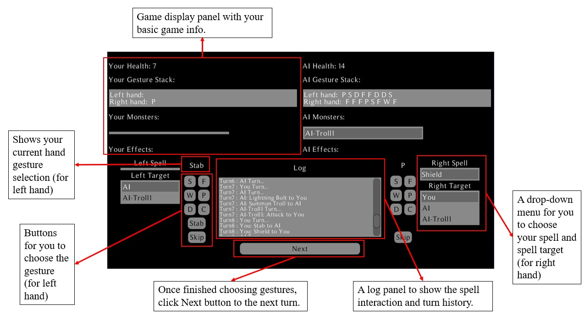
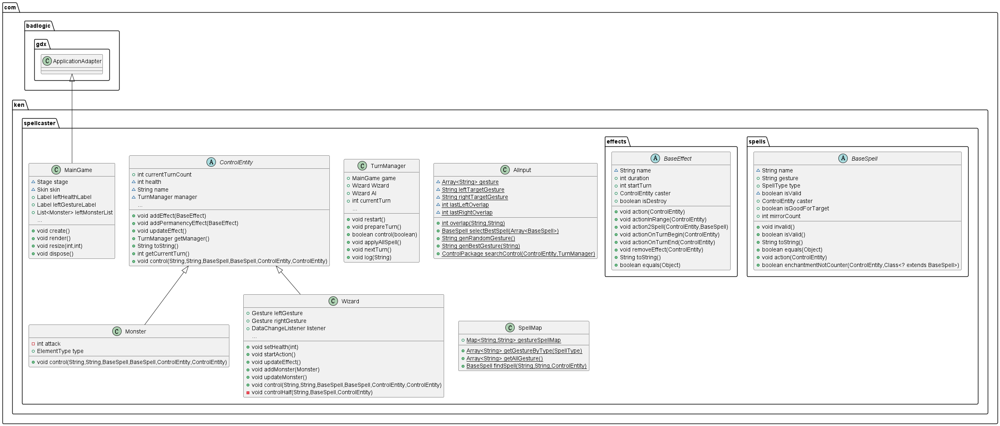
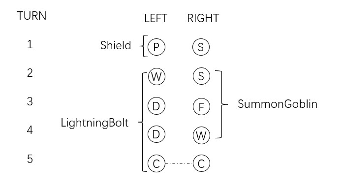
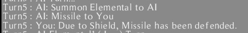
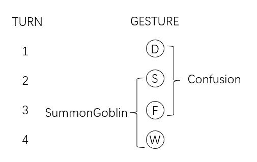

# Spellcaster
## Introduction
Spellcaster is a turn-based strategy board game for two players First proposed by Bartle in 1977, it has gone through several iterations. In Spellcaster, the players, as wizards, are able to choose different gestures each turn and have these gestures combined into a series of gesture sequences to form spells.

The implementation refer to the the website: [Spellcaster Game Rule Text](https://www.andrew.cmu.edu/user/gc00/reviews/spellcaster.html)

**This project is a java implementation of the game, using the LibGDX engine**

## Environment Configuration
In the implementation, The specific environment configuration version is as follows：
* **IDE**: IntelliJ IDEA Community Edition 2023.3
* **JDK version**: OpenJDK 17.0.7
* **Gradle version**: 7.5.1,
* **LibGDX engine version**: 1.12.1,
* **API used for the Android virtual machine**: API 34.

## How to run the code?
1. **Installation**: Clone the repository and compile the Java source files using Gradle.
2. **Run the Desktop game**: Run `desktop/src/com/ken/spellcaster/DesktopLauncher.java` to run the game on Desktop.

## UI Introduction and Operation Guide

**Note: Left and right hands are not in any order**

1. Select the left hand and right hand **gestures**, respectively.
2. Select the **spells** and **targets** to be released by the left and right hands (if applicable).
3. Click the **Next** button to enter the next turn.

## Code Structure

(The java source code is located at: `core/src/com/ken/spellcaster`.)

(The Desktop Launcher is located at: `desktop/src/com/ken/spellcaster/DesktopLauncher.java`.)

**effects folder**: store effects correspond to the spells (control gesture input, damage cancellation, etc.), **each efect is an independent class**, to easily add and manage. It contains an abstract class `BaseEffect`, which is the parent class of all effects, all effects inherit this class.

**entity folder**: also defines an abstract class `ControlEntity`, the player `Wizard` and the summoned object `Monster` both inherit this class.

**spells folder**: store the implementation of each spell, **each spell is an independent class**, meets OOP, easy to add new spells.
It also contains abstract class `BaseSpell`, which is inherited by all spell implementations.

**MainGame**: the entry point of the game, the basic five methods of LibGDX engine framework are here. The UI interface is created within this class. Handles the initialisation of the game.

**TurnManager**: Used to update the main loop of each turn, and control the turn flow of the game. Including applying spell to each entity, dealing with Spell effects and so on. At the same time through the
Observer Pattern to update the UI information. It is the core of the programme.

**SpellMap**: use `Map<String, String>` to store the spell, *key* is the gesture sequence, *value* is the Spell name. Use `findSpell` function for each String value to map to their corresponding Spell Class. `Array` defined by LibGDX engine is used here.

**AIInput**: implementation of AI algorithm, using Mini-Max idea. `overlap` function calculates gesture overlap and returns a score. `selectBestSpell` is used to evaluate the optimal spell selection based on the current state. `searchControl` method is the main method of AI

**Gesture**: custom Stack with `push` and `clear` methods for storing String type gestures (the String class itself is like a Stack). `genSpell` looks at the current gestures on the stack and returns the valid Spells if applicable. Once a gesture sequence is interrupted (no more new gestures can be combined with the previous gesture sequence to form new spells), the current stack is cleared.

Note: To add a new spell, simply have the new spell inherit `BaseSpell`, its effect inherit `BaseEffect`, and add the corresponding gesture and mapping for that spell in the `SpellMap`. : )

A UML diagram is shown below:

## Spellcaster game rule explanation
In Spellcaster, the player needs to choose gestures for both hands each turn, and use the sequence of gestures combined over multiple turns to form a spell. Deal damage and effects by casting these spells on the opponent to win.

### Basic Elements

**Wizard**: The player takes on the role of a wizard in the game, with an initial 15 health point. As a wizard, the player has the ability to cast spells independently with each hand, as well as powerful spells that require both hands to work together. During each turn, the player is able to make a gesture with each of the left and right hands, directly stab opponents (physically deal 1 damage) or choose to do nothing.

**Gestures**: There are three types of gestures that the player can perform, including five one-handed gestures: fingers (`F`), palm (`P`), snap (`S`), wave (`W`) and digit pointing (`D`); one two-handed gesture (i.e., both hands must make the same choice): clap (`C`); and `stab` (a physical attack that causes 1 damage), and `skip` (doing nothing).

Different combinations of gesture sequences can cast different spells, for example: three consecutive turns of fingers (`F`) can cast *ParalysisSpell* (`F-F-F`) (which restricts the opponent's gesture choices for the next turn).

**Spells**: In Spellcaster, spells are classified into 4 types:

*PROTECTION SPELL*: This class of spells is mostly defensive effect, capable of applying shields, healing or counter damage.

*SUMMON SPELL*: This is a special class of spells that summon different Monsters.

*DAMAGING SPELL*: This type of spell is capable of dealing damage (to a wizard or a monster). Some damaging spells have special effects, such as: FireBallSpell instantly kills Ice Elemental (a monster) in addition to dealing 5 points of damage.

*ENCHANTMENT SPELL*: These spells have the ability to apply a variety of effects, such as limiting the opponent's gesture choices, gaining an extra turn, and so on.

*Monsters*: Monsters are summoned by Summon spells, and have their own attack power and health point; their target is chosen by the controller.

### Game Mechanics
**Turn-based**: Spellcaster is a turn-based game. Each player takes a turn. During each turn, the wizard can choose one gesture for each of the left and right hands. After several turns, the left and right hands will each form a different sequence of gestures, which may form a spell. An example of a spell formation is shown below:

**Spell Interaction**: Spells can interact with each other in different ways. For example, most spell damage can be defended by *ShieldSpell*, or can be countered by *CureLightWoundsSpell*. Also, some of the Enchantment Spell's effects are invalidated by the *RemoveEnchantmentSpell*. The following figure shows the *ShieldSpell* interaction example：

**Spell Overlap Mechanism**: This is one of the core mechanics in Spellcaster, and can be very strategic. Each spell requires a different sequence of gestures. If the gesture sequences required for two spells have overlap, players can share these gestures when casting the spells consecutively without needing to input them again. That is, certain parts of a gesture sequence can simultaneously belong to the sequences of different spells.

For example, *ConfusionSpell* sequence is `D-S-F`, while *SummonGoblinSpell* sequence is `S-F-W`, then by choosing the `W` gesture (which creates `D-S-F-W`) on the next turn after casting ConfusionSpell, *SummonGoblinSpell* can be cast directly. The following figure shows the effect of Overlap

